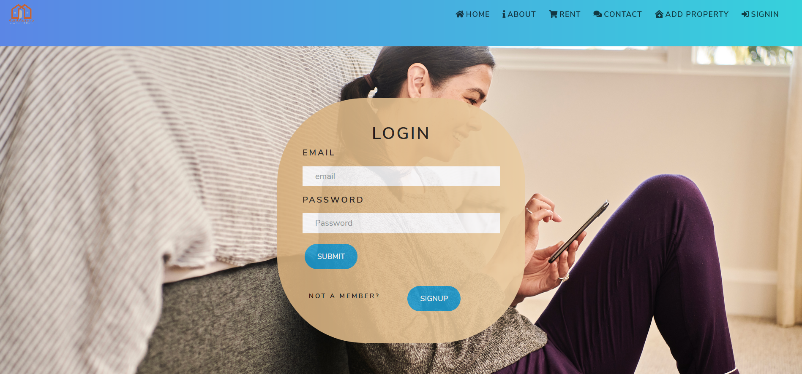
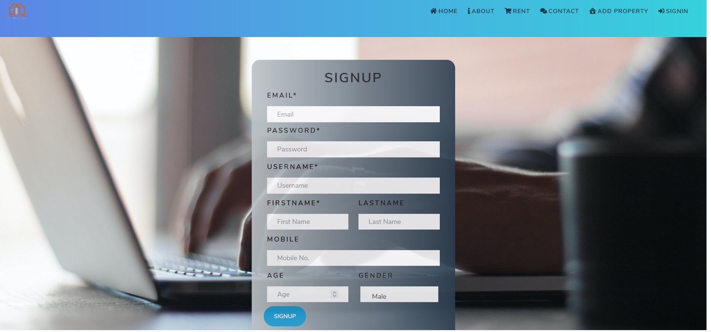
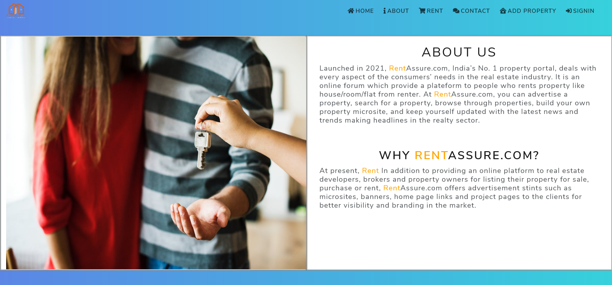
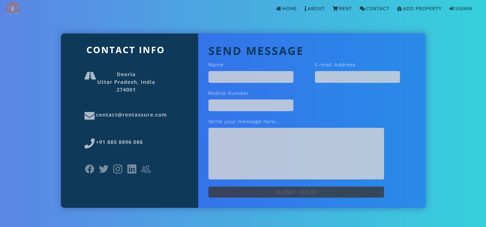
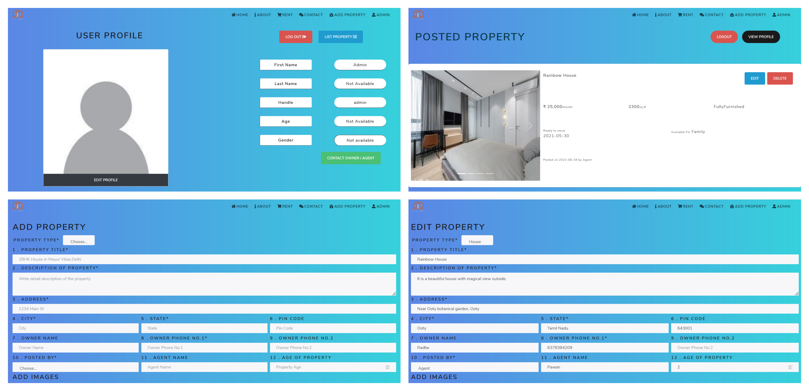

# RentAssure

   

This project was build with the help of [React](https://reactjs.org) ,[Django](https://www.djangoproject.com/start/) & [Djano REST framework](https://www.django-rest-framework.org/).

<a href="https://rentassure-bda5e.web.app/">

## Some More Screenshots

### Login & Signup

### About & ContactUs

### Other

</a>

## Installation

### Pre-requisites

Your machine should have NPM and Node installed. A full guide for installing each of these is given below.
Before you install any packages, ensure your package list is up to date with:

    sudo apt-get update

#### Install yarn

    sudo apt-get install -y npm

#### Install node

    sudo npm cache clean -f
    sudo npm install -g n
    sudo n stable

## Local setup

#### Clone the repo

    git clone https://github.com/iTs-rd/RentAssure-Forntend.git

#### Install node modules

    npm install

#### Running the server

    npm start

Visit [http://localhost:3000](http://localhost:3000) in your browser.

The app is running live at [https://rentassure-bda5e.web.app/](https://rentassure-bda5e.web.app/). Patience recommended while opening:stuck_out_tongue_closed_eyes:

Made in :heart: with Github & ReactJS.
